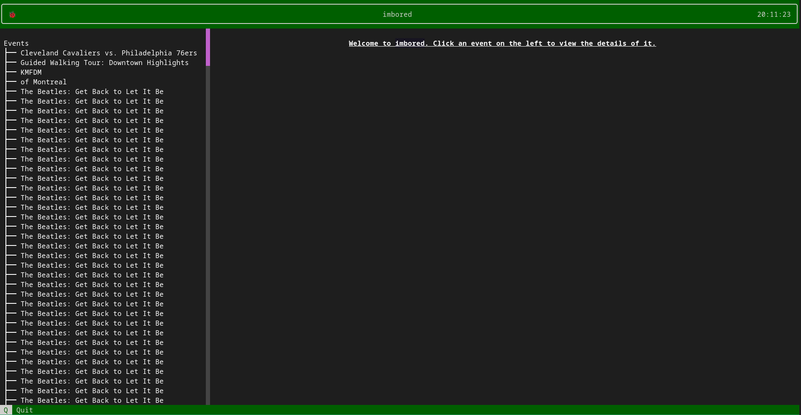
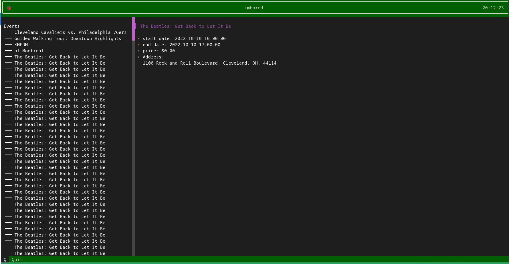

[](https://github.com/psf/black)
# imbored

> Displays local events in the city of Cleveland in a tui

This application scrapes event data from https://www.thisiscleveland.com/things-to-do/event-calendar. At the moemnt it's reading these events from a local copy of an older instance of the page. The program will eventually be updated to pull directly from the website. The data is then displayed in a tui.




## Installation

Use git to clone the repository.

```console
$ git clone https://github.com/thechrislee/imbored.git
$ cd imbored
$ poetry shell
```

## Usage

```console
imbored
```

## Contributing
Pull requests are welcome. For major changes, please open an issue first to discuss what you would like to change.

Please make sure to update tests as appropriate.

## License
[MIT](https://choosealicense.com/licenses/mit/)
